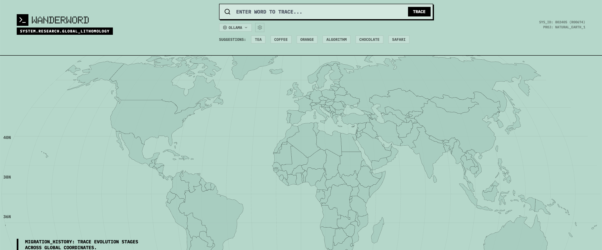

# WanderWord

Interactive etymology visualization showing how words migrate across the globe through history.



## Features

- **Interactive World Map** - D3.js powered map with zoom/pan, animated journey paths
- **Multi-AI Provider Support** - 8 different AI providers (CLI agents, APIs, local)
- **Auto-detection** - Checks installed CLI tools, discovers Ollama models
- **Playback Controls** - Step through word journeys with adjustable speed
- **Settings Panel** - Configure API keys and Ollama directly in UI

## AI Providers

| Provider | Type | Context | Setup |
|----------|------|---------|-------|
| Gemini CLI | CLI Agent | 1M tokens | Pre-installed CLI |
| Claude CLI | CLI Agent | 200k tokens | Pre-installed CLI |
| Codex CLI | CLI Agent | 128k tokens | Pre-installed CLI |
| Qwen CLI | CLI Agent | - | Pre-installed CLI |
| Gemini API | Direct API | - | API Key |
| OpenAI API | Direct API | GPT-4o-mini | API Key |
| Anthropic API | Direct API | Claude Sonnet | API Key |
| Ollama | Local | Auto-detect | Local install |

## Quick Start

```bash
# Install dependencies
npm install

# Start API server (terminal 1)
npm run server

# Start dev server (terminal 2)
npm run dev

# Open http://localhost:5174
```

## Configuration

### CLI Agents
Automatically detected on startup. The app shows ✅ for installed and ❌ for missing CLI tools.

Required CLIs: `gemini`, `claude`, `codex`, `qwen`

### API Keys
Click ⚙️ to open settings:
- **Gemini API**: [Google AI Studio](https://aistudio.google.com/)
- **OpenAI API**: [OpenAI Platform](https://platform.openai.com/)
- **Anthropic API**: [Anthropic Console](https://console.anthropic.com/)

### Ollama
1. Install [Ollama](https://ollama.ai/)
2. Pull models: `ollama pull llama3`
3. Select "Ollama" - models auto-detected in dropdown

## Environment Variables

```bash
# .env (optional - can configure in UI)
VITE_GEMINI_API_KEY=AIza...
VITE_OPENAI_API_KEY=sk-...
VITE_ANTHROPIC_API_KEY=sk-ant-...
VITE_OLLAMA_BASE_URL=http://localhost:11434
CLI_AGENTS_PATH=/path/to/cli-agents
```

## Usage

1. **Enter a word** (e.g., "coffee", "tea", "algorithm")
2. **Select provider** - CLI agents shown with install status
3. **Click TRACE** to research etymology
4. **Playback controls** to step through journey
5. **Info panel** shows full narrative

### CLI Tool

```bash
npm run etymology coffee
npm run etymology tea -- --model claude --timeout 90
```

## Project Structure

```
wanderword/
├── src/
│   ├── components/       # WorldMap, SearchInput, InfoPanel
│   ├── services/         # AI provider integrations
│   └── types/            # TypeScript interfaces
├── server/
│   └── api.ts            # CLI agent proxy + Ollama discovery
└── public/
    └── world-110m.json   # Map topology
```

## API Endpoints

```bash
# Call CLI agent
POST /api/cli-agent
{"model": "gemini", "prompt": "...", "timeout": 60}

# Check installed CLI agents
GET /api/cli-agents/check

# List Ollama models
GET /api/ollama/tags?baseUrl=http://localhost:11434
```

## Tech Stack

- React 19 + TypeScript + Vite
- D3.js + topojson for map
- Framer Motion for animations
- Tailwind CSS for styling

## Credits

Inspired by [WanderWord](https://wanderword-141284551734.us-west1.run.app/) (author unknown).

## License

MIT
